# ShoutOut user guide

<!-- Generated from src/content/user-guide.ts by `npm run guide:docs`. Edit that file, not this one. -->

Everything you need to recognise colleagues with ShoutOut: signing in, sending shoutouts, joining in, and finding recognition. The last part covers the admin tools.

Also available in the app at **/guide**.

## Contents

- [Signing in](#signing-in)
- [The feed](#the-feed)
- [Sending a shoutout](#sending-a-shoutout)
- [Your quarterly budget](#your-budget)
- [Reactions and comments](#reactions-and-comments)
- [Editing or deleting your shoutout](#editing-and-deleting)
- [Searching and filtering the feed](#search-and-filter)
- [People and profiles](#people-and-profiles)
- [The leaderboard](#leaderboard)
- [Reporting a shoutout](#reporting)
- [Light and dark mode](#light-and-dark)
- [Email notifications](#email-notifications)
- [Moderation](#admin-moderation) (admins)
- [Cards and values](#admin-cards-and-values) (admins)
- [Exports and the audit log](#admin-export) (admins)
- [Analytics](#analytics) (admins)

## Using ShoutOut

### Signing in

ShoutOut uses your normal work account, so there is nothing new to remember. Everyone who can sign in can send and receive shoutouts.

1. Open ShoutOut and choose **Sign in with your work account**.
2. Sign in on your company's login page.
3. You arrive on the feed. Choose **Sign out** at the top right when you're done; it signs you out of your work account too.

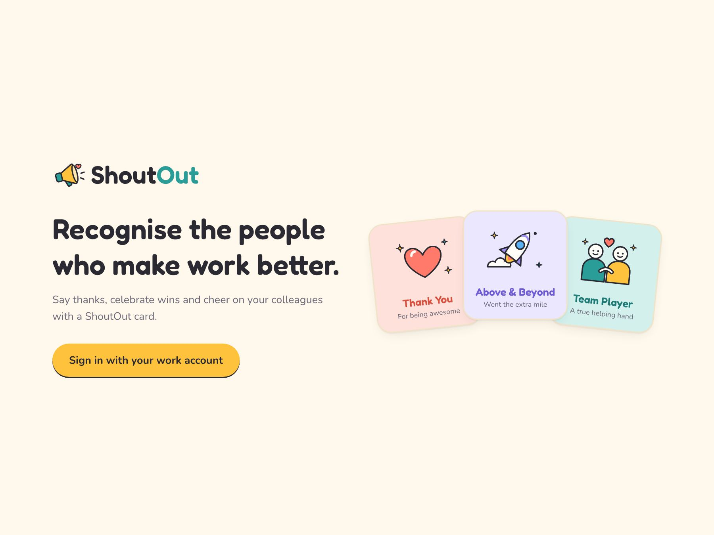

### The feed

The feed is your home page. It shows the latest shoutouts you can see, newest first, with your remaining budget and this month's most recognised colleagues alongside.

- Each shoutout shows who it is for, who sent it, the card, the company value it celebrates and the message.
- Choose **Show older shoutouts** at the bottom to go further back.
- Choose a person's name to open their profile.

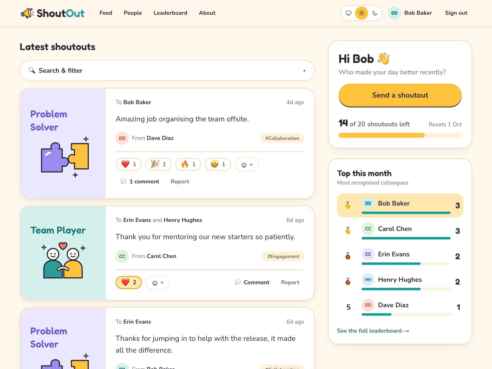

### Sending a shoutout

A shoutout is a short, specific thank-you on a card, tied to one of our company values.

1. Choose **Send a shoutout** on the feed.
2. Under **Who are you recognising?**, start typing a name and pick the person. Add more people if a group made it happen (up to five).
3. Pick a **card** that fits the moment.
4. Pick the **company value** they showed.
5. Under **Say thanks**, write what they did and what it changed, in up to 280 characters. The preview on the right shows how it will look.
6. Choose who can see it: **Public** (everyone) or **Private** (only you and the people you're thanking).
7. Choose **Send shoutout**. It appears in the feed straight away.

- You can't send a shoutout to yourself.
- Specific beats general: “Rewrote the onboarding docs before the new starters arrived” says more than “Thanks for everything”.

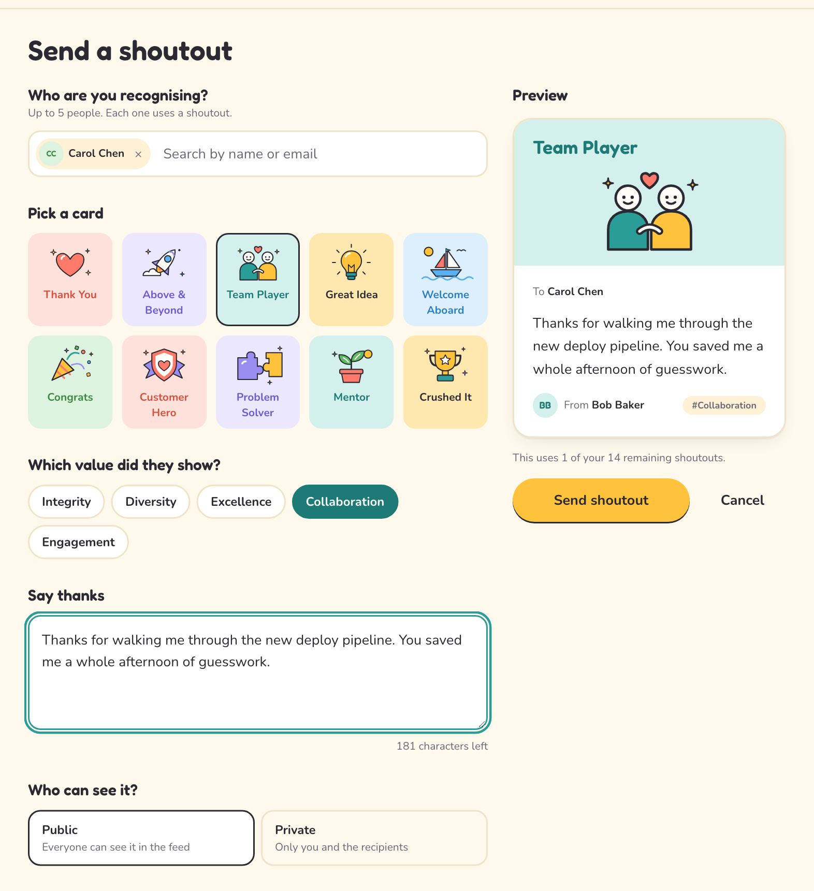

### Your quarterly budget

Everyone gets a set number of shoutouts each calendar quarter (20 unless your company changed it). Each person you thank uses one, so a shoutout to three people uses three.

- The meter on the feed shows what you have left and when it resets.
- The budget resets on the first day of each quarter; unused shoutouts don't carry over.
- Deleting a shoutout within 24 hours gives the budget back.

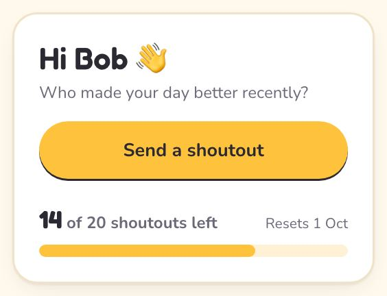

### Reactions and comments

Join in on any shoutout you can see. Reactions and comments don't use your budget.

1. Choose an emoji under a shoutout to react. Choose it again to take your reaction back.
2. Choose **☺ +** to pick a different emoji.
3. Choose **Comment** (or the comment count) to open the shoutout and add a comment.

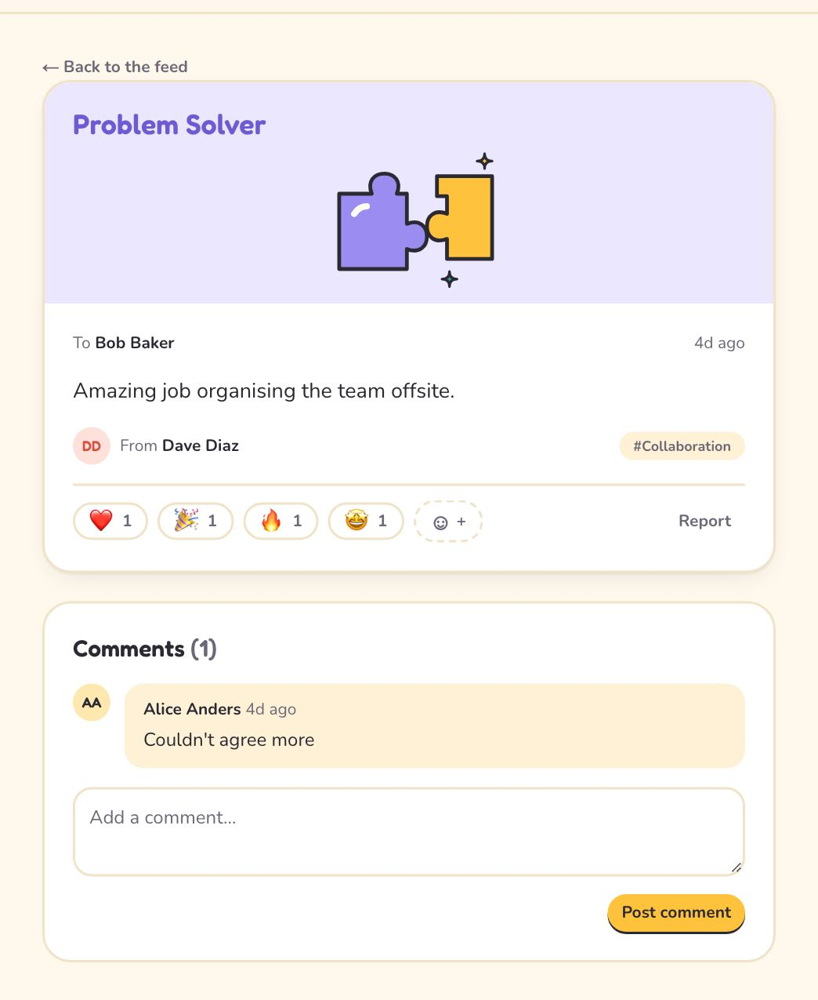

### Editing or deleting your shoutout

Made a typo or picked the wrong card? You can change or remove your own shoutout for 24 hours after sending it.

1. Find the shoutout in the feed.
2. Choose **Edit** to change the card, value, message or visibility. The recipients can't be changed; delete it and send a new one instead.
3. Choose **Delete** to remove it. The shoutouts it used go back into your budget.

- After 24 hours the Edit and Delete buttons disappear.

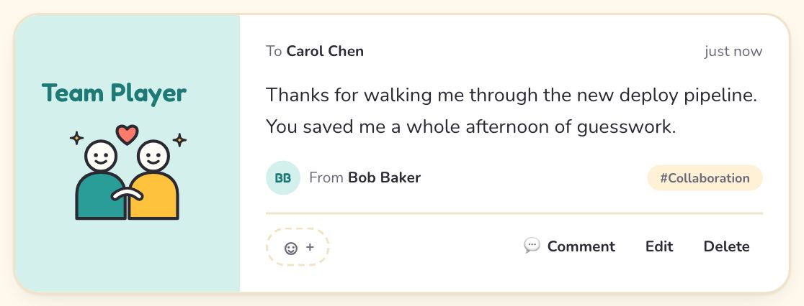

### Searching and filtering the feed

Looking for a particular shoutout? Narrow the feed down.

1. Open **Search & filter** above the feed.
2. Search the message text, pick a person (sent or received), a value, a card, or a date range.
3. Choose **Apply filters**. Choose **Clear** to see everything again.

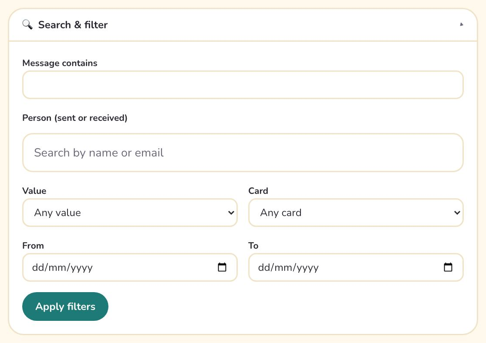

### People and profiles

Find anyone in the company and see the recognition they've received and given.

1. Choose **People** in the top menu and start typing a name or email; results update as you type.
2. Choose a person to open their profile: shoutouts they've received and sent, and the values they're most recognised for.
3. Choose **Recognise** followed by their name to start a shoutout.

- Other people see only public shoutouts on a profile. On your own profile you also see private ones you sent or received.
- On a phone, the light and dark mode switch is on your own profile page.

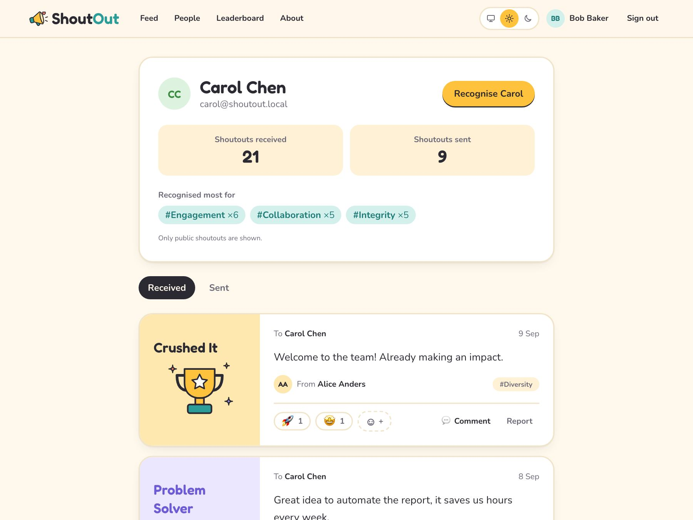

### The leaderboard

See who has been recognised most, who recognises others most, and which values show up most, for this week, month, quarter or all time.

- Your own row is highlighted, even if you're outside the top ten.
- Private shoutouts count too, but only as numbers.
- It's a way to spot who might be overlooked, not a competition.

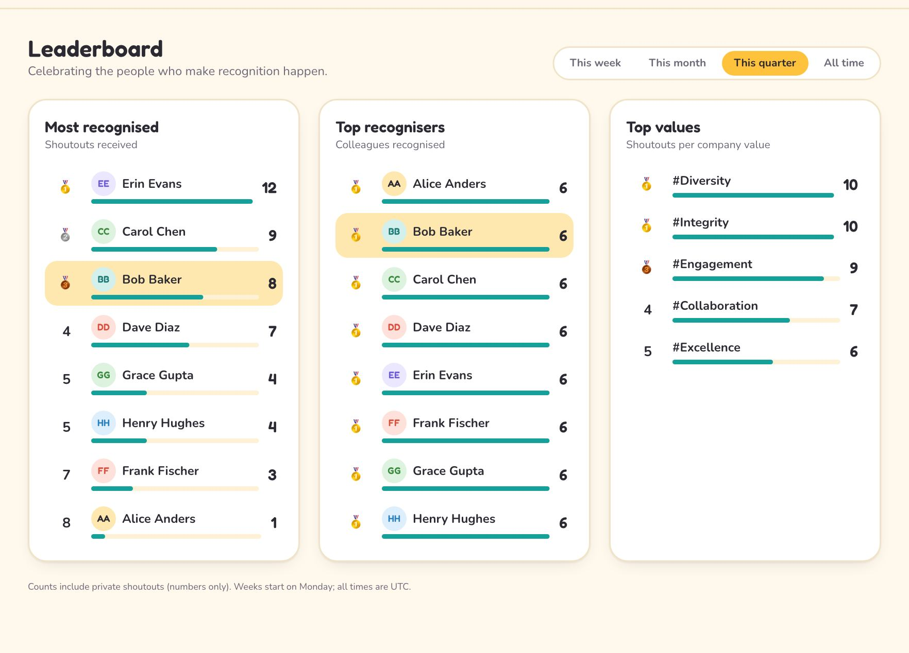

### Reporting a shoutout

If a shoutout is unkind, inappropriate or spam, report it. It is hidden from everyone straight away until an admin reviews it.

1. Choose **Report** on the shoutout.
2. Pick a reason and, if you like, add a note for the admins.
3. Choose **Report shoutout**.

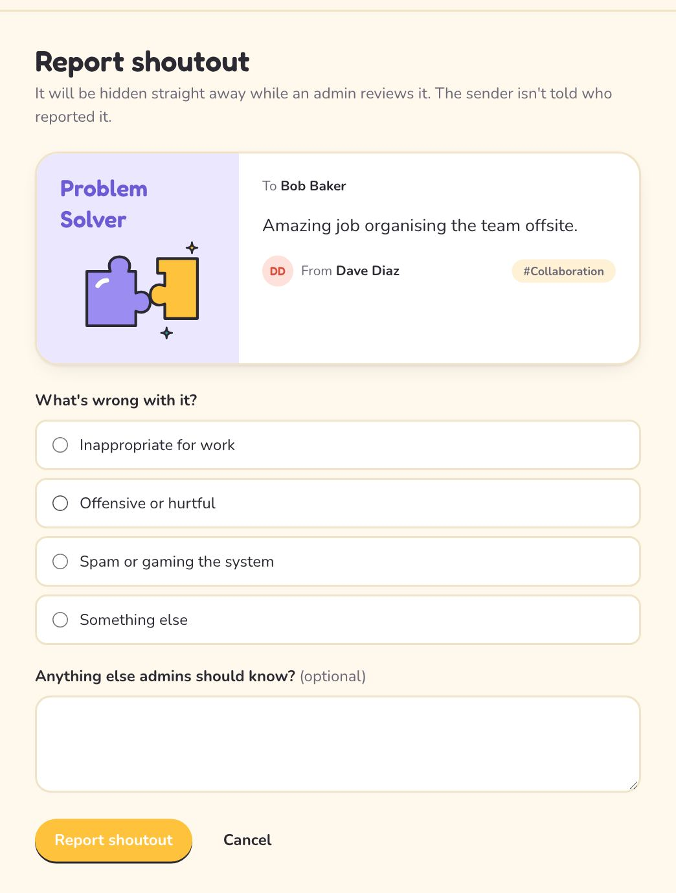

### Light and dark mode

Use the switch at the top right to choose light, dark, or match your device. On a phone it's on your profile page. ShoutOut remembers your choice.

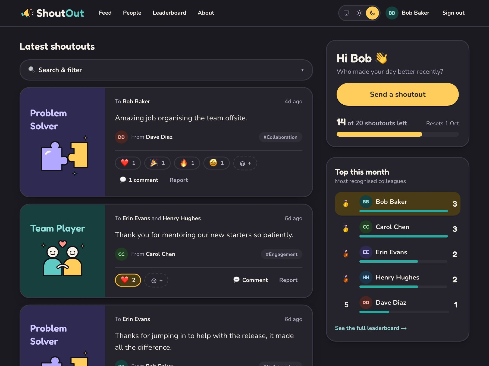

### Email notifications

If your company has turned email on, ShoutOut emails you when someone sends you a shoutout. Once a quarter, about two weeks before the budget resets, it also reminds you if you still have shoutouts left. Both are on unless you turn them off.

1. Choose your name or picture at the top right to open **your profile**.
2. Under **Email me**, untick the emails you don't want.
3. Choose **Save email settings**.

- Every email has a link straight to these settings.
- An email about a new shoutout arrives a couple of minutes after it's sent, so a quick edit by the sender is included.

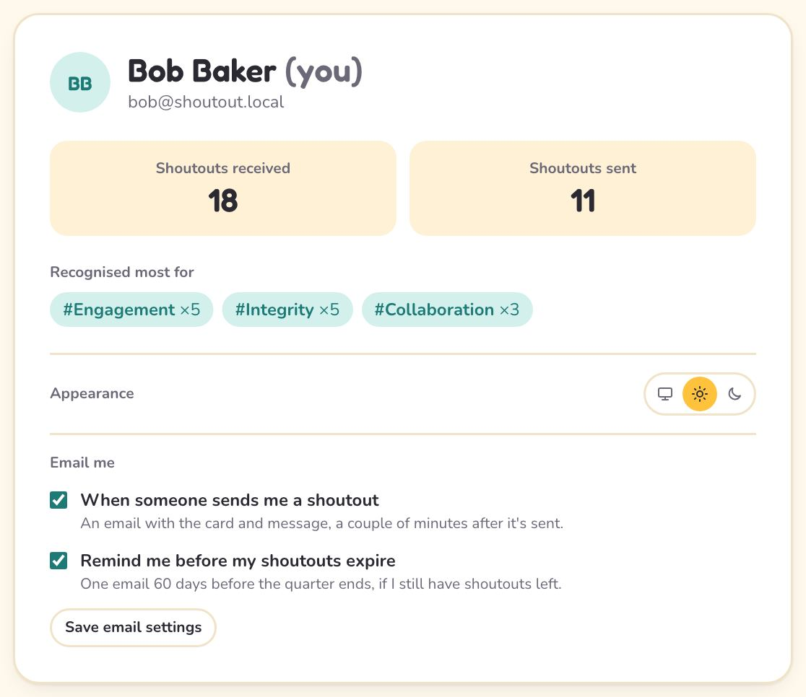

## For admins

### Moderation

Admins see **Admin** in the top menu. The first tab lists reported shoutouts, which are already hidden from everyone.

1. Read the shoutout, the reason and any notes. Private messages are shown here so you can judge them.
2. Choose **Restore** if it's fine: it reappears where it was.
3. Choose **Remove** if it breaks the rules: it stays hidden for good.

- A shoutout that was restored and is reported again is removed automatically.
- Every decision is recorded in the **Audit log**.

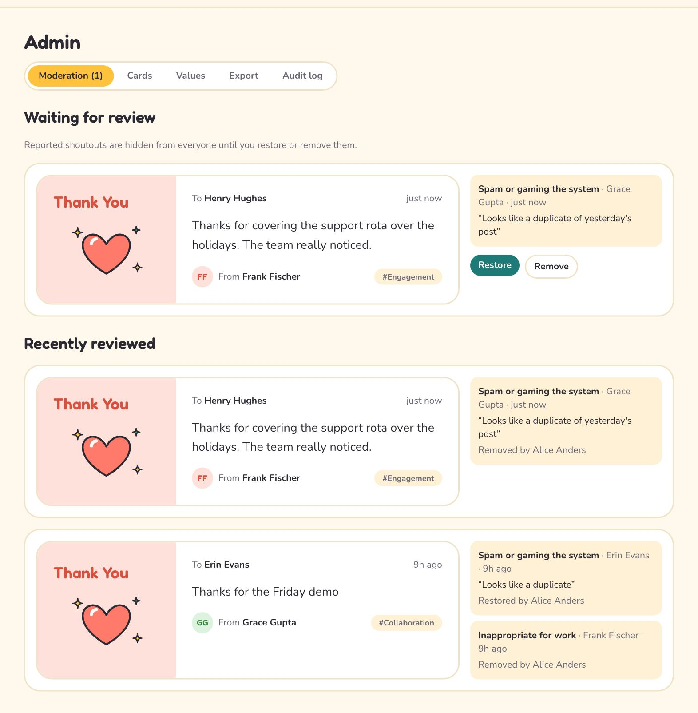

### Cards and values

Keep the card designs and company values current.

1. **Cards**: create a card from the built-in illustrations and colours, edit its title and tagline, move it up or down, or retire it.
2. **Values**: add, rename, reorder or retire a company value.

- Retired cards and values stay on old shoutouts; they just can't be picked for new ones.
- At least one card and one value must stay active.

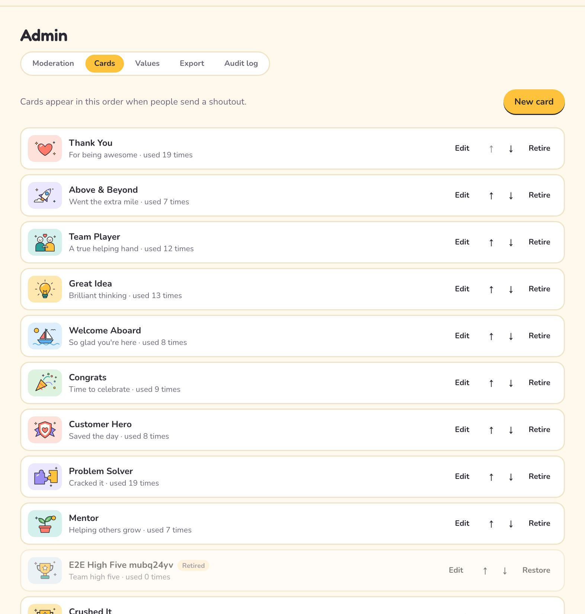

### Exports and the audit log

Download CSV files of all shoutouts, a per-person summary, or the leaderboards for any period. The **Audit log** shows who reported, moderated, changed or exported what, and when.

- Private messages are shown as [private] in the shoutouts export.

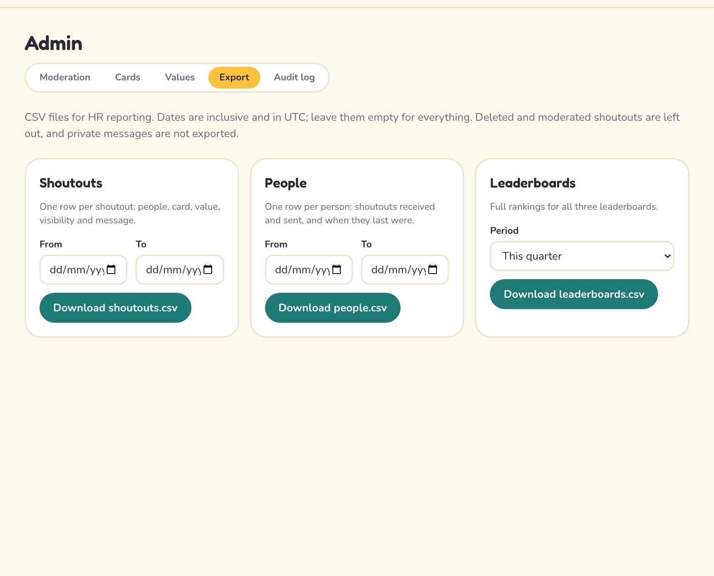

### Analytics

**Analytics** shows how recognition is going: totals and trends, participation, which values and cards are used, and who hasn't been recognised recently. Your company can choose to let everyone see it; the “not recognised recently” list is always admin-only.

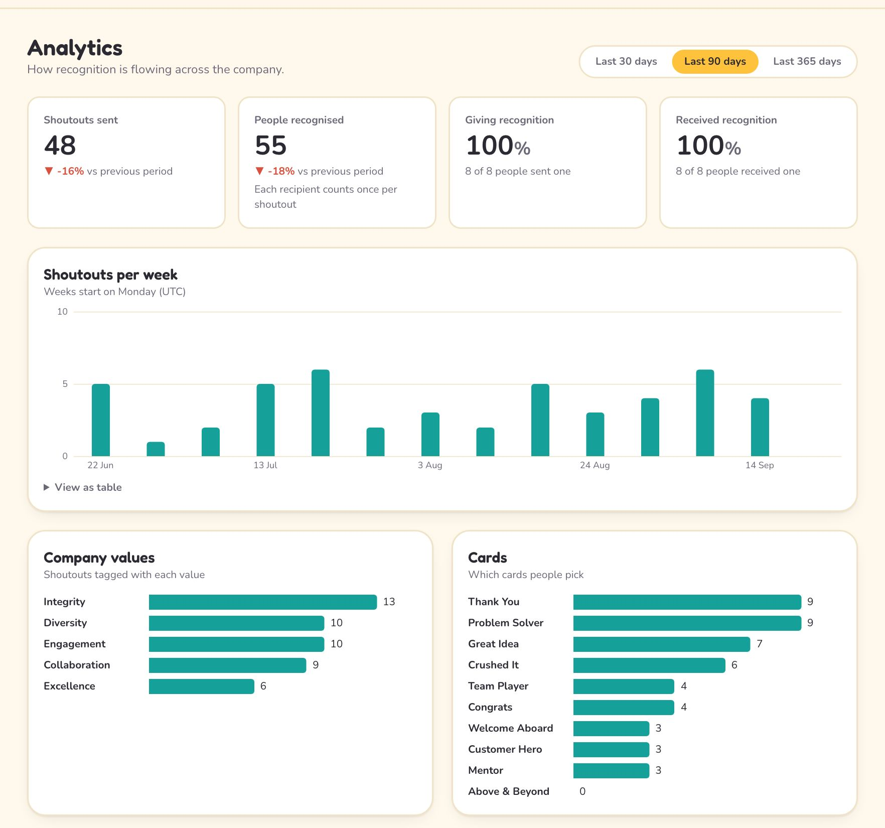
